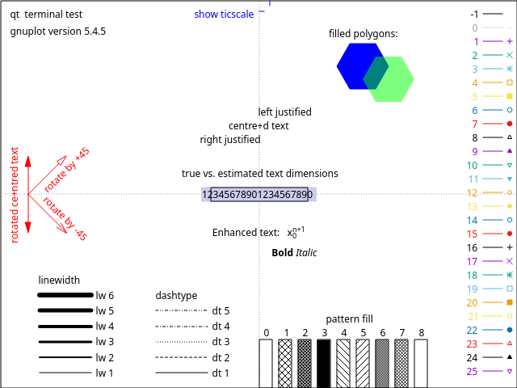

The main goal of this repository is to help users generate visually pleasing plots in a vectorial format using [gnuplot](http://www.gnuplot.info/).
We provide a collection of working examples for the most common types of plots, that can be taken and easily customized to minimize your time-to-plot.

To reach this goal we have written the examples following these two principles:
- Use the most simple data layout required to generate the plot.
- Keep the Gnuplot script the most self-explanatory and linear.
The idea is that it's easier to take a local copy of a bare-minimum example and then add any post-processing phase or expose tunable knobs, rather than understand how to use a feature-rich script that tries to cover all the possible cases.

If you are interested in the usage of Gnuplot, there are plenty of useful resources:

- [official documentation](http://www.gnuplot.info/documentation.html)
- [gnuplotting](http://www.gnuplotting.org/)

## File organization

Each folder is named after the general type of plot that it targets.
For some types, we also provide variants in a dedicated folder.
All the examples have the following files:
 - A CSV file with the plot data
 - The Gnuplot script, as a plain UTF-8 text file
 - A readme that describes the data layout and how to customize the script

For convenience, we might provide a simple Python script to perform trivial post-processing operations on data.

## From example to plot

1. Copy the most related example in your local directory
2. Read its readme to understand how to customize it
3. Replace the sample data with the real ones
4. Generate the plot with Gnuplot, which is a matter of `gnuplot < plot.gnuplot > plot.pdf`

## Customization opportunities

A significant fraction of the customization opportunities are trivial, such as changing colors and labels.
The user can easily change both of them.
However, sometimes it is possible to change line types, point types, or pattern types.
In Gnuplot, these types are integer numbers.
We suggest using the `test` command in the Gnuplot shell to display all the available types and their numerical id.
For example, this is a screenshot from Gnuplot 5.4:

