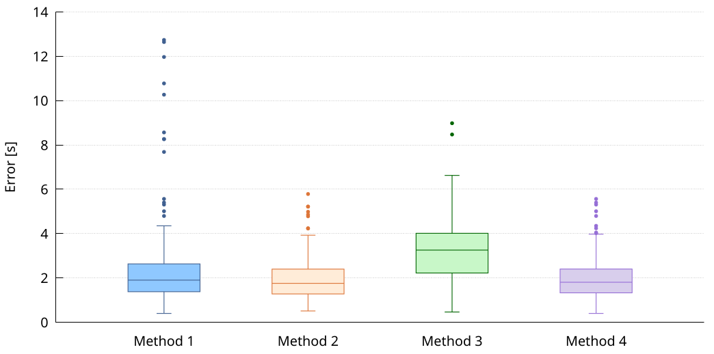

## Data layout

The CSV file has a number of columns equal to the number of distribution that we want to plot.
Each row of a column has its observed values.
It is important that all the column have the same number of rows.
If we have distributions with a different number of values, we can use `N/A` to fill the table.

## Customization opportunities

* Change the color of the distributions/lines/dots, by editing the `plot` statement
* Change the range of the y-axis, by editing the `yrange` statement
* Change the label of the y-axis, by editing the `ylabel` statement
* Change the plot size (and aspect ration) and font size, by editing the `terminal` statement

> **NOTE:**
> We can manipulate the x-value of each distribution to play with their distance.
> In the example, we use the `xtics` statement to set all the label at any given x-value.
> While in the plot command we use `(1)` to indicate that we want the distribution with column name "Method 1" at x-value `1`.
> This give us flexibility to group distributions togheter or to separate them as we see it fit.
> In the example, we spaced them equally.