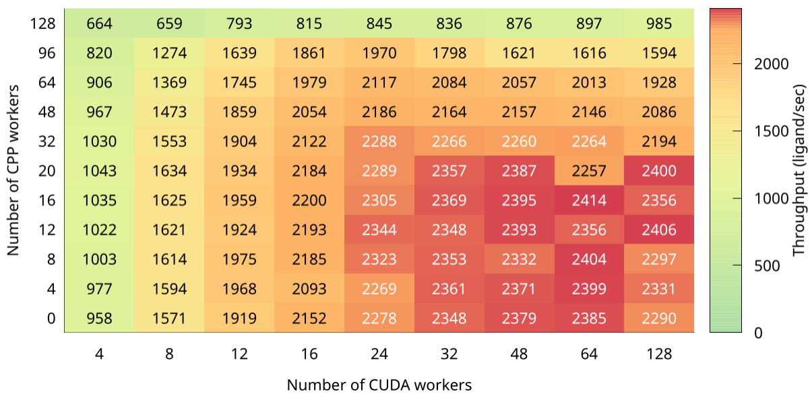

## Data layout

The CSV file is basically the matrix that we want to display.
The first row define the labels that want on the x-axys.
The first column define the labels that we want on the y-axys.
Each cell has the actual value that define the color.

## Customization opportunities

* Change the label of the y-axis, by editing the `ylabel` statement
* Change the label of the x-axis, by editing the `xlabel` statement
* Change the label of the color palette, by editing the `cblabel` statement
* Change the range of the color palette, by editing the `cbrange` statement
* Change the color palette, by editing the `palette` statement
  * By chaning the value of each color, you can alter the gradient. In this case please edit also the last two `plot` commands
* Change the plot size (and aspect ration) and font size, by editing the `terminal` statement

> **NOTE:**
> The plain heatmap has only the color, as stated by the first plot command.
> However, we think is more clear to also print the actual numeric value.
> We use two different plot command to have the label with different colors, to improve the plot readability.