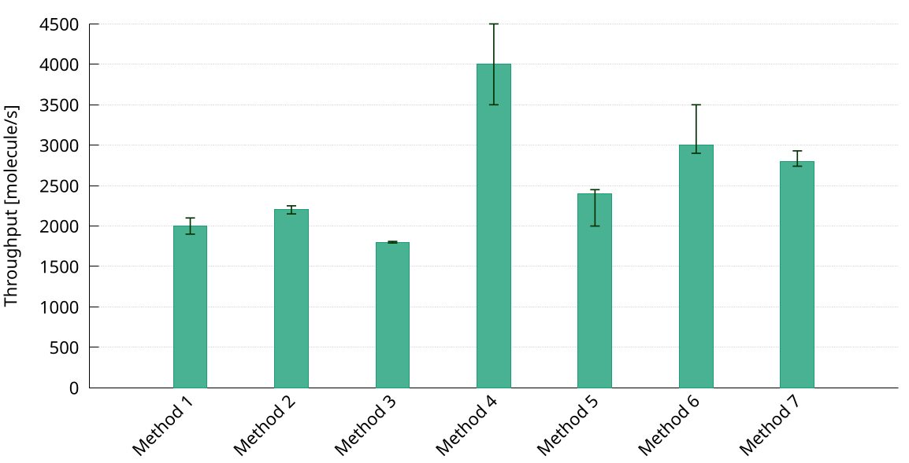

## Plot example

## Data layout

The CSV file has the following four columns:
1. The label for the data row to display on the x-axys
2. The bar height
3. The low value for the error bar
4. The high value for the error bar

## Customization opportunities

* Change the color of the vertical bars, by editing the `plot` statement
* Change the range of the y-axis, by editing the `yrange` statement
* Change the label of the y-axis, by editing the `ylabel` statement
* Change the plot size (and aspect ration) and font size, by editing the `terminal` statement
* Change the error bars color and width, by editing the `errorbars` statement
