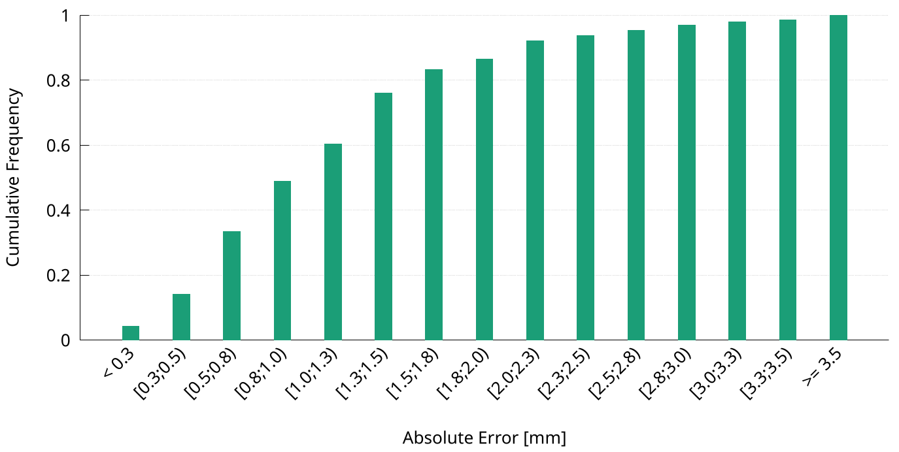

## Probability density function example


## Cumulative distribution function


## Data layout

If we consider as input file a CSV with all the observed values as first column, named `distribution.csv`, then we need to use a Python script to compute the `data.csv` that perform data binning, producing the file `data.csv`.
Only the latter file is required to generate the plot and it is a CSV file with two columns:
1. the label that describes the interval value
2. the relative frequency

To generate the latter file you can use the command `python3 compute_freq.py  < distribution.csv > data.csv` to generate the probability density function, or the command `python3 compute_freq.py --cumulative  < distribution.csv > data.csv` to generate the cumulative density function.

Please, refer to the help message to further customization details:
```
usage: python3 compute_freq.py [-h] [-m MIN] [-M MAX] [--bin_width WIDTH] [--cumulative] [--separator SEP] < /path/to/dist.csv > /path/to/histogram.csv

Read from the standard input a CSV-like file that represents the distribution. Print on the standard output a CSV
file that represents the PDF of the first column. If the 'cumulative' switch is set, we print the cumulative
distribution instead.

options:
  -h, --help         show this help message and exit
  -m MIN, --min MIN  The minimum value in the plot
  -M MAX, --max MAX  The maximum value in the plot
  --bin_width WIDTH  The width of each bin
  --cumulative       If set, we compute the cumulative frequency
  --separator SEP    The CSV column delimiter

```

## Customization opportunities

* Change the color of the vertical bars, by editing the `plot` statement
* Change the range of the y-axis, by editing the `yrange` statement
* Change the label of the y-axis, by editing the `ylabel` statement
* Change the label of the x-axis, by editing the `xlabel` statement
* Change the plot size (and aspect ration) and font size, by editing the `terminal` statement
* Change the data binning by tweking the command line options of the python script
