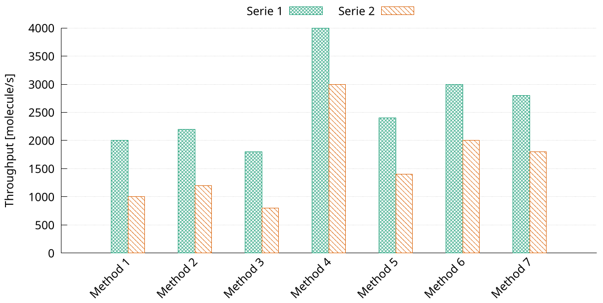

## Data layout

We use a dedicated CSV file for each serie.
All of them have the following two-column structure.
The first column state the label for each value that we want on the x-axys.
The second column state the related y-value.

> It is important that all the CSV files share the same labels (first column)

## Customization opportunities

* By editing the `plot` statement we can change the following properties:
  - the pattern type
  - the pattern color
  - the title of the serie, which will be in the legend
* Change the range of the y-axis, by editing the `yrange` statement
* Change the label of the y-axis, by editing the `ylabel` statement
* Change the plot size (and aspect ration) and font size, by editing the `terminal` statement
