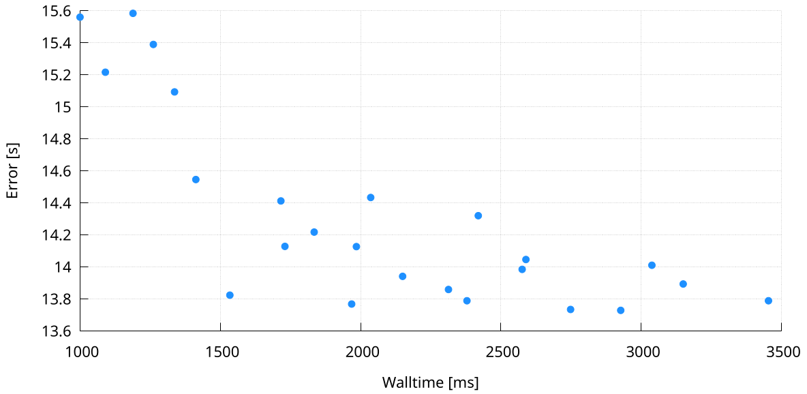

## Data layout

The CSV file is basically a list of x- and y-values.
Each row represents a point

## Customization opportunities

* Change the dots size, type, and color, by editing the `plot` statement
* Change the range of the y-axis, by adding the `yrange` statement
* Change the label of the y-axis, by editing the `ylabel` statement
* Change the range of the x-axis, by adding a `xrange` statement
* Change the label of the x-axis, by editing the `xlabel` statement
* Change the plot size (and aspect ration) and font size, by editing the `terminal` statement