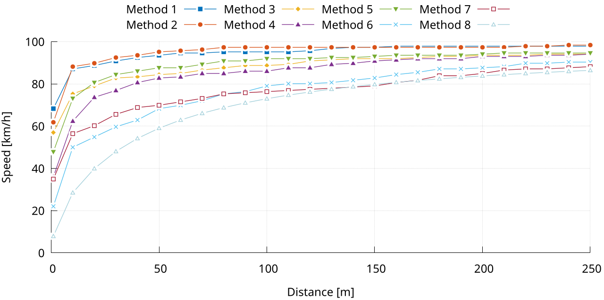

## Plot example

## Data layout

The CSV file has a number of columns equal to the number of lines that we want to plot, plus a column with the x-values.

> **NOTE:**
> If each line has a different set of x-values, it is possible to use a dedicated file

## Customization opportunities

* Change the properties of each line, by editing the `syle` statements
* Change the range of the y-axis, by editing the `yrange` statement
* Change the label of the y-axis, by editing the `ylabel` statement
* Change the range of the x-axis, by adding a `xrange` statement
* Change the label of the x-axis, by editing the `xlabel` statement
* Change the plot size (and aspect ration) and font size, by editing the `terminal` statement
* Change the position of legend, by editing the `key` statement